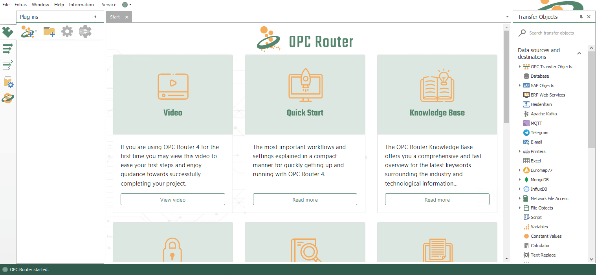
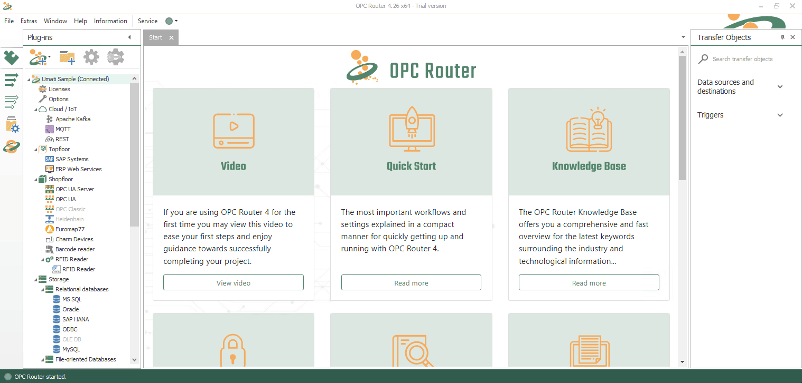

<div align="center">
  <a href="https://opc-router.com/?utm_source=GitHub&utm_medium=DockerSample&utm_campaign=OpcUaUmatiMssqlGrafana">
    
  </a>
    <br />
    <br />
  <h1 align="center">OPC Router Docker Sample</h1>
  <p align="center">
    OPC Router Docker Sample for a Umati MSSQL communication with Grafana Dashboard.
    <br />
    <a href="https://opc-router.com/?utm_source=GitHub&utm_medium=DockerSample&utm_campaign=OpcUaUmatiMssqlGrafana"><strong>OPC Router</strong></a>
    -
    <a href="https://www.opc-router.com/contact-and-support/?utm_source=GitHub&utm_medium=DockerSample&utm_campaign=OpcUaUmatiMssqlGrafana"><strong>Contact</strong></a>
    <br />
    <br />
  </p>
</div>

# tl;dr
### **Windows**
```powershell
$(Invoke-WebRequest https://docker.opc-router.cloud/opc-ua-umati-mssql-grafana/win -UseBasicParsing).Content | iex
```
### **Linux**

Download via **curl**:
````bash
bash <(curl -sSLf https://docker.opc-router.cloud/opc-ua-umati-mssql-grafana/linux)
````  

Download via **wget**:
````bash
bash <(wget -O - https://docker.opc-router.cloud/opc-ua-umati-mssql-grafana/linux)
````  

**If something is unclear, please read our [documentation](#About-the-Sample) for this sample.  
  Should your question still not be answered, feel free to [contact](https://www.opc-router.com/contact-and-support/?utm_source=GitHub&utm_medium=DockerSample&utm_campaign=OpcUaUmatiMssqlGrafana) us**


# About the Sample
## Contents
* [About the Sample](#About-the-Sample)
  * [General Info](#general-information)
    * [What is the sample doing?](#What-is-the-sample-doing?)
  * [Components](#components)
* [Getting Started](#Getting-Started)
  * [Prerequisites](#Prerequisites)
  * [Installation](#Installation)
    - [Windows](#Windows)
    - [Linux](#Linux)
* [Usage](#usage)
    - [Grafana](#Grafana)
    - [OPC Router Management](#Opc-Router-Management)
      *  [Configure the connection](#2.-Configure-Connection)
* [Other samples](#Other-samples)
* [Contact](#contact)

## General Information
> The OPC Router 4 is generally structured in two parts:
> - The Runtime
> - Management with the user interface
>  
> The two components may run on two completely different systems.  
> To set/edit the OPC Router 4, it is connected to the OPC Router Runtime via OPC Router Management, this abstraction allows the settings to be made remotely.
### **What is the sample doing?**
- This docker sample is a fully functional OPC Router 4 project sample.
- The goal is to use an Umati OPC UA server, with the help of the OPC Router 4, to store data in an MSSQL database and visualize it through Grafana.


## Components
- [OPC Router](https://opc-router.com/?utm_source=GitHub&utm_medium=DockerSample&utm_campaign=OpcUaUmatiMssqlGrafana#test-now)
- [Docker](https://www.docker.com/)
- [Umati OPC UA Server](https://umati.org/)
- [Grafana](https://grafana.com/)
- [MSSQL](https://www.microsoft.com/de-de/sql-server/)

# Getting Started

## **Prerequisites**
For both operating systems, there are prerequisites that must already be met:
- Connection to the Internet
- Browser (If you are using **Firefox** then use a Version greater than **95.0.1**)
- [OPC Router Managment](https://opc-router.com/?utm_source=GitHub&utm_medium=DockerSample&utm_campaign=OpcUaUmatiMssqlGrafana#test-now) (The OPC Router management is available for Windows systems)

### **Windows**
A system with Docker and OPC Router Management installed is a prerequisite for the project. This same system is required to have internet access.
If you don't have Docker installed yet, you can download it [here](https://www.docker.com/get-started). The OPC Router Management can be found on our [website](https://opc-router.com/?utm_source=GitHub&utm_medium=DockerSample&utm_campaign=OpcUaUmatiMssqlGrafana#test-now).
- Docker


### **Linux**  
In order to download and install the sample on Linux there are specific requirements

- wget or curl
- root user rights **(Only for the installation of docker-runtime and docker-compose)**

 ### **automatic Installation:**
💡 When installing on a Linux-based machine, all required applications can be installed automatically, this is done during setup.  

### **manually Installation:**
 ⚠️ If you do not want the applications to be installed automatically, you must do this manually:
  - Docker
  - Docker-compose


## **Installation**
Now open the command line after you have installed the required software for your operating system:  
**❕This process may take up to a couple of minutes❕**
### **Windows**
```powershell
$(Invoke-WebRequest https://docker.opc-router.cloud/opc-ua-umati-mssql-grafana/win -UseBasicParsing).Content | iex
```
### **Linux**

Download via **curl**:
````bash
bash <(curl -sSLf https://docker.opc-router.cloud/opc-ua-umati-mssql-grafana/linux)
````  

Download via **wget**:
````bash
bash <(wget -O - https://docker.opc-router.cloud/opc-ua-umati-mssql-grafana/linux)
````  

## **Ready to Use**
You should now have installed everything successfully and you can now explore the possibilities of the OPC Router.  
If something unexpectedly fails here, feel free to [contact](https://www.opc-router.com/contact-and-support/?utm_source=GitHub&utm_medium=DockerSample&utm_campaign=OpcUaUmatiMssqlGrafana) us

# Usage

## **Grafana**
Grafana is started directly with the installation and can now be viewed directly. 
Now you only have to call the address [http://localhost:3000/](http://localhost:3000/d/v972rfT7k/sample-dashboard) to the interface with your browser and see the visualized data directly.

> ❗ Make sure that you can only call the localhost address if you are on the device that is also used for the Docker installation, otherwise you have to call the address of the device on which the Docker installation is located.


## **OPC Router Management**
If you want to view the communication between the Umati OPC UA server and the OPC Router Runtime which serves as middleware that forwards the data to the MSSQL database, start the OPC router management now.

### **1. Add Runtime to the OPC Router Management**
To be able to observe the data transfers you have to connect to the OPC Router Runtime first.  
 Click on the plus symbol at plug-ins in the OPC Router Management (see gif)...

...and select **Integrate existing service...**


### **2. Configure Connection**
-   Name: (You can write here what you want)
-   Username & Password **(Let it Empty)**
-   Server IP: 127.0.0.1
    > ❗ Make sure that you can only call the localhost / 127.0.0.1 address if you are on the device that is also used for the Docker installation, otherwise you have to call the address of the device on which the Docker installation is located.
-   Port: 27020

Enter your docker hosts IP address and Port 27020, click **Test connection** and confirm with **OK**.


### **3. Open the status page**
To observe the current and historical transfers select the state panel and click on the connection **Umati2SQL**


**Now you can see the current and previous transfer data, this allows a direct insight into the traffic and the interaction of the individual plug-ins.**  
>💡 The overview allows you to follow the actions of the OPC Router (the green dots in the timeline), in case of possible errors you can see here exactly where the error comes from.

# Other Samples
To get an even bigger insight into the work of the OPC Router we have created more Docker samples with other exciting combinations of plugins.

>💡With its numerous [Plug-ins](https://www.opc-router.com/plug-ins/?utm_source=GitHub&utm_medium=DockerSample&utm_campaign=OpcUaUmatiMssqlGrafana), the OPC Router can be used flexibly. In both simple and complex system environments, it can connect a wide variety of applications with each other.
- [Microsoft Teams via Rest API](https://github.com/OPC-Router/opc-ua-uaserver-msteams)
- [InfluxDB](https://github.com/OPC-Router/iot-edge-opc-plc-influx-db)
- [Umati & InfluxDB2](https://github.com/OPC-Router/opc-ua-uaserver-msteams)

# Contact
If you have any questions or even problems with the implementation of the sample, feel free to [contact](https://www.opc-router.com/contact-and-support/?utm_source=GitHub&utm_medium=DockerSample&utm_campaign=OpcUaUmatiMssqlGrafana) us
